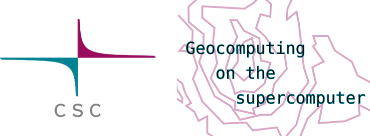

.. Geocomputing course  master file, created by
   sphinx-quickstart on Mon Jul 17 12:16:50 2023.
   You can adapt this file completely to your liking, but it should at least
   contain the root `toctree` directive.

Welcome to CSC Geocomputing course!
====================================

* Are you working with geospatial data and running close to the limits of your own computing environment? 
* Are you curious on how you can take your geospatial data processing and analysis to the next level? 
* Or maybe you have been using a supercomputer already, but would like to make sure your are getting the most out of it?

→ **This course is intended for you!**

In this course we will learn the basics of geocomputing on a supercomputer through a combination of lectures and hands-on activities. The main focus of the course is Puhti supercomputer, were all hands-on exercises will be done. The CSC services discussed in this course are free-of-charge for academic research, education and training purposes for Finnish higher education institutions and state research institutes (subsidized by the Ministry of Education and Culture, Finland). 

Most of the course content also applies to LUMI supercomputer, which is available for academic users **and companies**. 

The course is meant both for academic researchers planning to use Puhti supercomputer and for data analysts from private companies planning to use LUMI.

.. warning::
   THIS MATERIAL IS WORK IN PROGRESS, do not trust anything ! ;) 

.. toctree::
   :maxdepth: 2
   :caption: Practicalities

   materials/prerequisites.md
   materials/practicalities.md
   materials/cheatsheet.md

.. toctree::
   :maxdepth: 2
   :caption: CSC - IT Center for Science

   materials/csc.md
   materials/csc_services.md
   materials/account_project.md
   materials/support.md 

.. toctree::
   :maxdepth: 2
   :caption: Supercomputer - intro

   materials/examples.md
   materials/supercomputing.md  
   materials/spatial_data_at_csc.md
   materials/software.md
   materials/webinterface.md
   materials/exercise_webinterface.md

.. toctree::
   :maxdepth: 2
   :caption: Terminology and concepts

   materials/terminal.md
   materials/terminology.md
   materials/supercomputer_setup.md
   materials/disk_areas.md
   materials/partitions.md
   materials/job_types.md
   materials/fair_share.md
   materials/batch_job.md
   materials/exercise_basics.md

.. toctree::
   :maxdepth: 2
   :caption: Running jobs efficiently

   materials/job_monitoring.md
   materials/htc.md
   materials/exercise_gdal.md

.. toctree::
   :maxdepth: 2
   :caption: Own environments and code

   materials/exercise_python.md
   materials/exercise_r.md 
   materials/installations.md
   materials/own_project.md

.. toctree::
   :maxdepth: 2
   :caption: Data

   materials/moving_data.md   
   materials/stac.md    
   materials/allas.md  

.. toctree::
   :maxdepth: 2
   :caption: Wrap-up
  
   materials/wrapup.md
   materials/where_to_go.md
