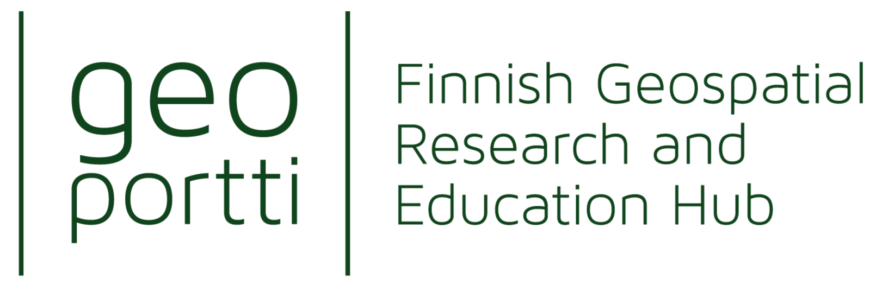

# [CSC -IT center for Science](https://www.csc.fi/)

* Non-profit company producing IT services for research and higher education
* Owned by ministry of education and culture (70%) and higher education institutions (30%)
* Headquaters in Keilaniemi, Espoo
* Side offices and supercomputers in Kajaani
* ~650 people

## [Geoportti](https://www.geoportti.fi)

Geoportti Research Infrastructure (RI) is a shared service for researchers, teachers and students using geospatial data and geocomputing tools. Geoportti RI helps the researchers in Finland to use, to refine, to preserve and to share their geospatial resources.

## [Location Innovation Hub](https://locationinnovationhub.eu)

The Location Innovation Hub (LIH) is a centre of excellence in location information coordinated by the Finnish Geospatial Research Institute. Our services are produced in conjunction with a partner network. We help companies to grow their business with location information. We also serve the public sector.

