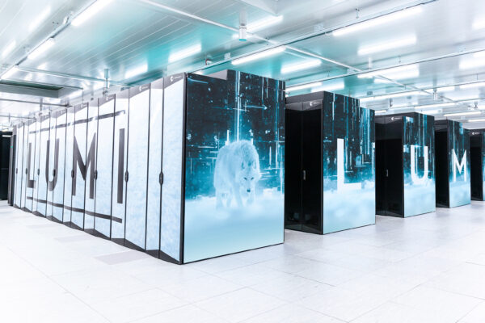

# CSC Supercomputers

Name | CPUs | GPUs | Pre-installed GIS tools | Finnish spatial data locally | Scope |
--- | --- | --- | --- | --- | --- |
**Roihu** | **187 000** | ~500 Nvidia GH200 | **15** | **Yes** | Finland |
**LUMI** | 100 000 | **~24 000** AMD MI250X GCD | 6 | No | EU |

Roihu:
* CSC'c new national supercomputer
* **The first option to consider for Finnish academic projects**
* [CSC Docs: Technical details about Roihu](https://docs.csc.fi/computing/systems-roihu/)

LUMI:
* Owned by LUMI consortium: 11 countries + EU
* For very large scale analysis
* Mainly GPU-machine -> for deep learning projects
* **For companies and international projects**
* [LUMI Docs: Hardware overview](https://docs.lumi-supercomputer.eu/hardware/)

## Roihu compared to other options

|  | Roihu supercomputer| cPouta virtual machine| my laptop |
|---|---| ---|---|
|Max per job: CPU | **23 000** | 48 | 4 |
|Max per job: memory, Gib | **6037 ** | 240 | 18 |
|Max per job: GPU | **40** | 4 | 1 |
|Pre-installed GIS tools | **Yes** | No | No |
|Main Finnish datasets  | **Yes** | No | No |
|Admin rights | No | **Yes** | Yes |
