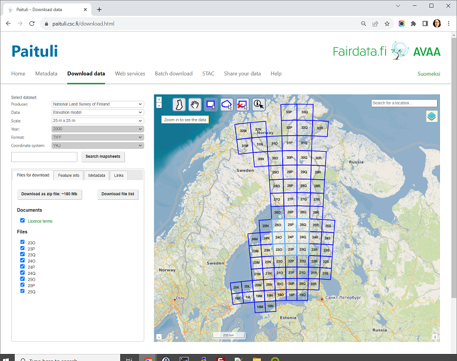

# Spatial data in Puhti

* Large commonly used **Finnish geospatial datasets with open license**
* Removes transfer bottleneck
* Located at: `/appl/data/geo/`
* **All Puhti users have read access**
* ~13 TB of datasets available:
	* **Paituli data**, with virtual mosaics for raster data
	* **Finnish Environmental Institute (SYKE) open datasets**: CORINE land use etc
	* **LUKE, Multi-source national forest inventory**: 2013, 2015, 2017, 2019 and 2021.
	* **Forest center: canopy height**, forest mask, gridcells, forest resource plots
* LUMI and Mahti do not have spatial data on local disk.
* [CSC Docs: Spatial data in CSC computing environment](https://docs.csc.fi/data/datasets/spatial-data-in-csc-computing-env/)

## Paituli

* **Spatial data download service**
* ~300 Finnish datasets
* All datasets open to everyone
* Also **historical versions** of several datasets
* Possibility to publish own datasets for universities and research institutes
* Ministry of education and culture supports financially, CSC maintains
* [Paituli](https://paituli.csc.fi)

### Paituli data access in Puhti:

* As files in `/appl/data/geo/`
* **Raster datasets via [STAC](stac.md)**
* Rasters divided to mapsheets as **virtual rasters**
* Majority via [OGC APIs](https://paituli.csc.fi/webservices.html), both old and new standards

:::{admonition} Virtual rasters
:class: seealso, dropdown

Virtual rasters are a useful GDAL concept for managing large raster datasets that are split into map sheets that do not overlap. Technically a virtual raster is just a small XML file that tells GDAL where the actual data files are, but from user's point of view virtual rasters can be treated much like any other raster format. Virtual rasters can include raster data in any file format GDAL supports. Virtual rasters are useful because they allow handling of large datasets as if they were a single file eliminating the need for locating correct files.

* Virtual rasters are not useful for managing time-series or overlapping rasters, for example remote sensing tiles.
* Supported by any GDAL based tool, including Python and R spatial packages, ArcGIS, FME, GrassGIS, MapInfo, QGIS, and SagaGIS. 
* [CSC Docs: Virtual rasters tutorial](https://docs.csc.fi/support/tutorials/gis/virtual-rasters/), inc code examples for R and Python.
:::

### Some popular datasets

* NLS, administrative borders
* **NLS, topographic database**
* NLS, basic map and topographic maps
* NLS, DEM - 2, 10 and 25m
* **NLS, orthoimages (only infrared in Puhti)**
* Statistics Finland, population grid 1 km
* Statistics Finland, municipalities key figures
* Statistics Finland, educational institutions
* **Väylä, Digiroad**
* Statistics Finland, traffic accidents
* Statistics Finland, Paavo - statistics at post code level
* **NLS, lidar**
* Finnish Digital agency, addresses of buildings
* LUKE, occurrence map for less common tree species
* Finnish Food Agency, Field plots
* **FMI, daily and monthly weater statistics and predictions**
* University of Helsinki, Luomus, biodiversity threats
